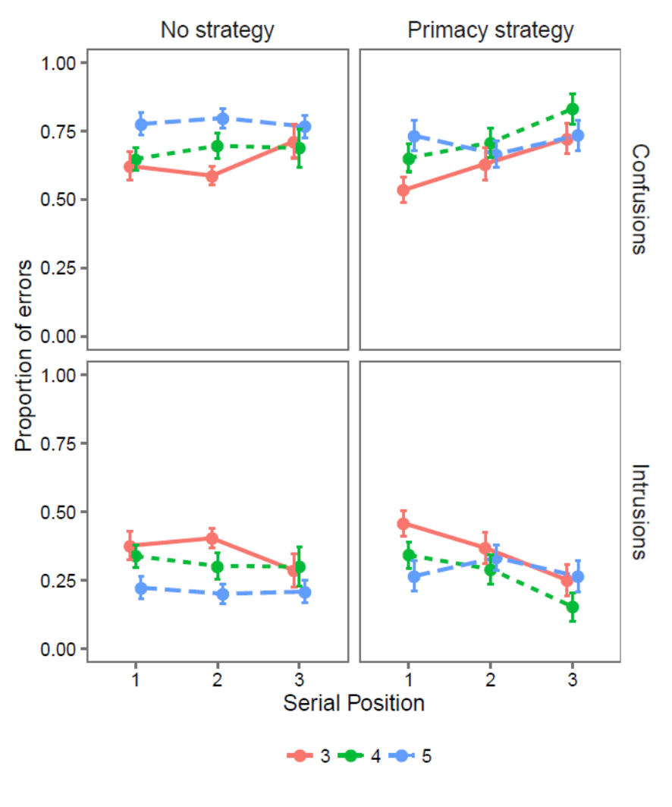
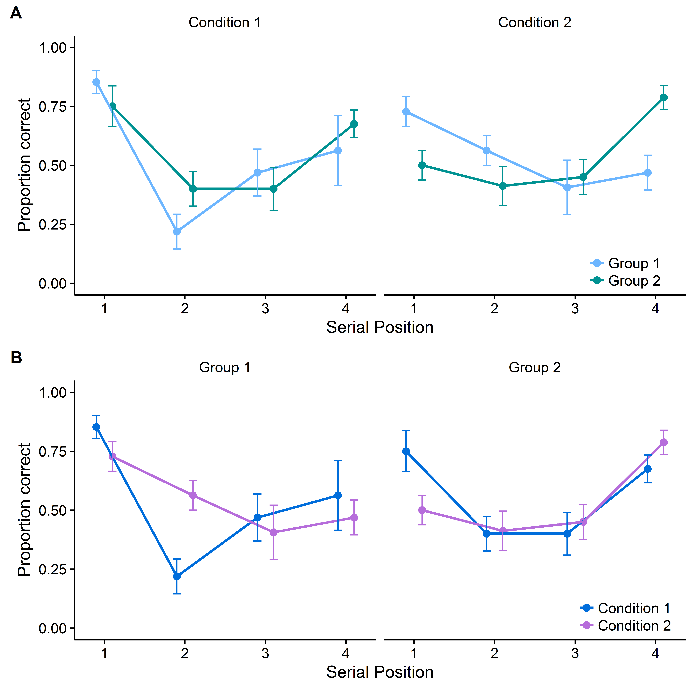
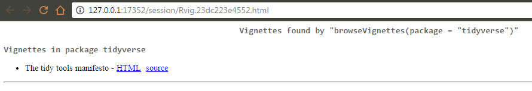
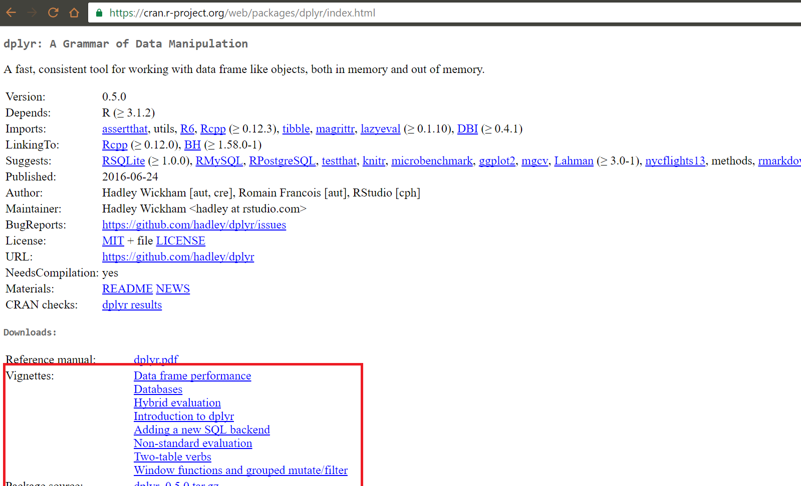

```{r setup, include = F}
library(knitr)
library(tidyverse)
library(ggthemes)
library(RColorBrewer)
library(broom)

knitr::opts_chunk$set(echo = FALSE, fig.align = "center")

```

## Overview
+ Why now?
+ Why R?
+ General tips
+ Recommended packages
+ Recommended resources

## Why now? | Efficiency
+ Point-and-click software just isn't time efficient
+ Automating tasks will pay off within the time frame of a PhD and thereafter

## Why now? | Reproducibility
+ There is an increasing expectation that materials, data, and analysis details are provided alongside research to ensure it is reproducible
    + This is easier when things are script based 
+ [Peer Reviewers' Openness Initiative](https://opennessinitiative.org/)

## Why R? | Jobs
+ R is increasingly taught in Psychology departments, including at undergraduate level
+ Useful skill for jobs outside academia 
+ Makes you a more efficient academic 

## Why R? | Pretty graphs

<div align = "center", class="columns-2">
  

  
  
</div>   

## Why R? | Range of packages
+ There are R packages for a huge range of analyses 
+ Great data manipulation packages
+ Slides 
+ Documents
    + Including books
+ Interactive HTML applications 


## Why R? | Reproducibility... again
+ R projects
+ R Markdown

## Why R
+ It's free
+ Big community 
+ R has the [happiest commenters](https://hackernoon.com/which-programming-languages-have-the-happiest-and-angriest-commenters-ebe91b3852ed#.fpgwgsb03)

# Recommended packages 

## General comments
+ Given the age of R there are many ways to complete a task
+ Most data manipulation tasks can be done with 'base R'
    + However, this often isn't the most efficient or readable approach 

## tidyverse
+ A collection of packages by Hadley Wickham for:
    + Data visualisation (ggplot2)
    + Data manipulation (dplyr)
    + Data tidying (tidyr)
    + Importing data (readr)
    + Functional programming (purrr)
        + See [here](https://blog.rstudio.org/2016/09/15/tidyverse-1-0-0/) for a full list of the included packages
+ These packages are all designed to work nicely together
+ More readable by people than most R code

## Installing tidyverse
+ To install and load any package you just do:

```{r, eval = FALSE, echo = T}
install.packages("tidyverse")
library(tidyverse)
```
+ You need to load a package in with `library()` for any new R session you want to use it with
+ Loading tidyverse loads all the packages described previously

## Recommended packages | The pipe operator
+ The pipe operator is key to why the tidyverse packages are so usable and readable
+ It passed the thing on its left as the first argument to a function on its right
    + x %>% f() is equivalent to f(x)
  
```{r, echo = T}
x <- c(10, 5, 15)

mean_x <- x %>% mean()
```

+ This is amazing for chaining together the various steps some data goes through without needing to create intermediary objects
+ Doesn't work so smoothly with some packages

## ggplot2
+ Build graphs by specifying:
    + Aesthetics: physical properties of the plot mapped to variables in the data (x & y positions, size, shape, colour etc.)
    + Geometries: what to actually use to represent the data (lines, bars, points etc.)

```{r}
x = rnorm(100) 
y = x*3 + rnorm(100, sd = 5)

df <- data_frame(x = x, 
                 y = y,
                 treatment = rep(c("treatment_1", "treatment_2"), each = 50))
```

## ggplot2 | qplot
```{r, echo = T}
qplot(x = df$x, y = df$y)
```

## ggplot2 | qplot
```{r, echo = T}
qplot(df$x, df$y) + 
  geom_smooth(method = "lm")
```

## ggplot2 | ggplot
```{r, echo = T}
ggplot(data = df, mapping = aes(x = x, y = y)) +
  geom_point() +
  geom_smooth(method = "lm")
```

## ggplot2 | ggplot

```{r, echo = TRUE}
ggplot(data = df, mapping = aes(x = x, y = y, colour = treatment)) +
  geom_point() +
  geom_smooth(method = "lm")
```

## ggplot2 | Other tips
+ The package `ggthemes` is good for providing premade plot 'styles'
+ `RColorBrewer` is useful for colours
    + Useful info on colour in `ggplot2` [here](http://www.cookbook-r.com/Graphs/Colors_(ggplot2)/)
+ `cowplot` is good for creating grids of labelled plots for papers
    + `cowplot` [vignette](https://cran.r-project.org/web/packages/cowplot/vignettes/introduction.html)

## ggplot2 | Other tips

```{r, echo = TRUE}
ggplot(df, aes(x, y, colour = treatment)) +
  geom_point() +
  geom_smooth(method = "lm") +
  theme_few() +
  scale_color_brewer(palette = "Set1")
```

## cowplot

<div align = "center">

  
  
</div> 

## Data visualisation | Other options
+ Three main options for data visualation: `base`, `lattice`, and `ggplot2`
+ `base` automatically produces certain plots when called on certain objects
    + e.g. calling `plot()` on a regression model object will produce diagnostic plots
+ In my view `ggplot2` is the easiest to learn - but that's probably because it the only one I'm good at!
    + See these posts for arguments [for](http://varianceexplained.org/r/why-I-use-ggplot2/) and [against](http://simplystatistics.org/2016/02/11/why-i-dont-use-ggplot2/) `ggplot2` over `base` for plots

## dplyr | overview
+ `dplyr` is designed around a set of basic 'verbs':
    + `filter()`: filter rows 
    + `arrange()`: arrange rows (e.g. ascending)
    + `select()`: select columns
    + `distinct()`: get unique rows
    + `mutate()`: create new variables
    + `summarise()`: summarise the data
+ Also has functions for joining data and lots of 'helper' functions
    
## dplyr | Some example data

```{r}
df1 <- data_frame(id = rep(1:30, each = 2),
                  stage = rep(c("practice", "test"), times = 30),
                  cond1 = rnorm(60), 
                  cond2 = rnorm(60), 
                  group = rep(c("group1", "group2"), each = 30)
                 )

head(df1, 10)
```


## dplyr | Summarising the data

```{r, echo = T}

sum_stats <- df1 %>%
  filter(stage == "test") %>%
  mutate(cond_diff = cond1 - cond2) %>%
  group_by(group) %>%
  summarise(mean = mean(cond_diff),
            sd = sd(cond_diff),
            n = n(),
            se  = sd/sqrt(n))
```

```{r}
sum_stats
```

## purrr | overview
+ `purrr` is a package for 'functional programming'
+ The functions you're likely to use most are the `map()` functions
    + Apply a function to a list, vector or dataframe
    + Have versions where you specific the class of object you're expecting back
        + 'Safer' than the `apply` family
            + Either work or break with an informative error message
+ Lots of other functions that are useful for writing your own functions
+ Cool purrr tutorial [here](https://jennybc.github.io/purrr-tutorial/)

## purrr | example

```{r eval = F, echo = T}
list <- paste("data/", list.files("data"), sep = "")

df <- map_df(list, read_csv)

```

## tidyr | Overview
+ Functions for tidying data
+ The thing to use for moving between long and wide data
+ E.g. suppose we have the wide data from before

```{r}
head(df1 %>% filter(stage == "test"))
```

## tidyr | Example

```{r echo = T}
df1_long <- df1 %>%
  gather(condition, score, cond1:cond2) %>%
  arrange(id)
  
```

```{r}
head(df1_long)
``` 

## Recommended packages | broom
+ For cleaning up the outputs of modelling functions [(vignette)](ftp://cran.r-project.org/pub/R/web/packages/broom/vignettes/broom.html)
+ Work very well with dplyr [(vignette)](ftp://cran.r-project.org/pub/R/web/packages/broom/vignettes/broom_and_dplyr.html)

```{r}

df2 <- data_frame(id = 1:60, 
                  year = rep(c("five", "two"), each = 30), 
                  memory = rnorm(60), 
                  attention = rnorm(60), 
                  attainment = memory * 1 + attention * 0.8 + rnorm(60))

head(df2, 8)
```

## Recommended packages | broom example (adapted from vignette)

```{r, echo = T}
df2 %>%
  group_by(year) %>%
  do(tidy(lm(attainment ~ memory + attention, data = .)))

```

## Recommended packages | rmarkdown
+ `rmarkdown` provides a range of tools for creating dynamic documents in R [(see this intro)](http://rmarkdown.rstudio.com/lesson-1.html) 
+ Can be used to create:
    + Reports (e.g. a paper)
        + Outputs to MS Word, PDF, or HTML
    + Slides
    + [Interactive Notebooks](http://rmarkdown.rstudio.com/r_notebooks.html)
    + Books via `bookdown`
    + See [here](http://rmarkdown.rstudio.com/formats.html) for a full list of formats

## Recommended packages | rmarkdown

+ Code can be embedded to make reproducible reports  
  
\     
**74** participants took part in Experiment 1 (Mean age = **8.65**, SD = **1.32**).  

`` `r inline_expr("nrow(wide)")` `` participants took part in Experiment 1 (Mean age = `` `r        inline_expr("round(mean(wide$age), 2)")` ``, SD = `` `r  inline_expr("round(sd(wide$age), 2)")` ``). 
  
\  

+ See [here](https://github.com/eddjberry/cutoff) for a useful function I've written for rounding values in R Markdown

## General tips | R Studio

+ Lots of useful stuff for R Markdown 
+ Generally just nice 
+ Download here: https://www.rstudio.com/products/rstudio/download/
+ Some [tips](https://www.r-bloggers.com/rstudio-ide-easy-tricks-you-mightve-missed/) for using R Studio

## General tips | R Projects
+ Great for organising bits of code related to a single project 
    + Raw data, processing script, processed data, analysis scripts, and manuscript all in one place
+ Git intergration 
+ With a bit of code at the top of the manuscript you have a fully reproducible workflow
+ Introduction to projects [here](http://r4ds.had.co.nz/workflow-projects.html)

```{r, eval = F, echo = T}  
source("scripts/data-processing.R")  
source("scripts/analysis.R")  
source("scripts/exploratory-analysis.R")   
```

## General tips | Organising projects

+ Some useful advice [here](https://pagepiccinini.com/r-course/lesson-1-r-basics/) on setting up a project (plus Git)
    + The advice for organisation is to have folders for data, figures, scripts and write-up
+ When working with a project the top folder is your working directory. This makes it very easy to call files from other folders

```{r eval = F, echo = T}
read_csv("data/exp-data-07-16.csv")
```

## General tips | Projects and R markdown

+ Note that when you run an R Markdown file the working directory is changed to the location of that file. 
+ if we have our file in a subfolder we need to change the way we call a file in different subfolder

```{r eval = F, echo = T}
source("../scripts/data-processing.R")  
```

+ `"../"` tells it to start at the parent folder of the current working directory

## General tips | Reuse and improve
+ Obviously the point of writing scripts is that they can be reused
+ However, don't just settle for whatever worked first. Try to work out the best way to do something
    + 'If you aren't getting frustrated you aren't learning' - Hadley Wickham 
+ Trying to improve old code when you revisit is a useful exercise
    
# Recommended resources

## Recommended resources | Datacamp
+ This is how I did most of my learning
+ They have loads of great courses, particularly:
    + [Introduction to R](https://www.datacamp.com/courses/free-introduction-to-r) & [Intermediate R](https://www.datacamp.com/courses/intermediate-r)
    + [Data Manipulation in R with dplyr](https://www.datacamp.com/courses/dplyr-data-manipulation-r-tutorial), [Joining Data in R with dplyr](https://www.datacamp.com/courses/joining-data-in-r-with-dplyr) & [Cleaning Data in R](https://www.datacamp.com/courses/cleaning-data-in-r)
    + [Data Visualisation with ggplot2](https://www.datacamp.com/courses/data-visualization-with-ggplot2-1)
    + [Writing Functions in R](https://www.datacamp.com/courses/writing-functions-in-r)
    + [Reporting with R Markdown](https://www.datacamp.com/courses/reporting-with-r-markdown)
+ Some of the courses can be tried for free 
+ Free when used for teaching (see [here](https://www.datacamp.com/groups/education))

## Recommended resources | Online stuff
+ [Coursera Data Science Specialisation](https://www.coursera.org/specializations/jhu-data-science/1?utm_medium=courseDescripTop)
    + I've not done it but hear that it's good.
+ [R Cookbook](http://www.cookbook-r.com/)
    + Though some of the solutions are now a bit out of date
+ [R Studio blogs](https://blog.rstudio.org/)
    + Lots of good blogs accompany package updates. 
    
## Recommended resources | Online stuff
+ [Stack Overflow](http://stackoverflow.com/tags/r/info)
    + You'll end up there by Googling a question
+ [R Studio cheatsheets](https://www.rstudio.com/resources/cheatsheets/)
+ R Studio R Markdown [website](http://rmarkdown.rstudio.com/)
+ There are loads of good blogs out there that you can find from Googling
    + Note the date of a blog post as the advice might be out of date

## Recommended resources | Online stuff

+ Package vignettes 
    + E.g. [Intro to dplyr](https://cran.r-project.org/web/packages/dplyr/vignettes/introduction.html)

```{r eval = F, echo = T}
browseVignettes(package = "tidyverse")
```
  
<div align = "center">

  
  
</div> 
  

## Recommended resources | Finding vignettes via Googling
<div align = "center">

  
  
</div> 
    

## Recommended resources | Books
+ [R for Data Science](http://r4ds.had.co.nz/) by Garrett Grolemund & Hadley Wickham
+ [bookdown: Authoring Books and Technical Documents with R Markdown](https://bookdown.org/yihui/bookdown/) by Yihui Xie
+ [Dynamic Documents with R and Knitr](https://www.amazon.co.uk/Dynamic-Documents-knitr-Second-Chapman/dp/1498716962/ref=asap_bc?ie=UTF8) by Yihui Xie
+ [Discovering Statistics Using R](https://www.amazon.co.uk/Discovering-Statistics-Using-Andy-Field/dp/1446200469/ref=sr_1_4?s=books&ie=UTF8&qid=1483428752&sr=1-4&keywords=andy+field) by Andy Field
    + Published in 2012 so the stuff on data manipulation, in particular, is out of date
    
## Misc tips
+ Find out all the stuff (e.g. functions) in a package loaded in with `library()`
    + `ls("package:dplyr")`
+ Show the documentation for a function
    + `?select`
+ Save and object and also print it to the console
    + `(x <- rnorm(10))`
+ Shortcut for `<-`
    + `Alt`+`-`
        + You can also just use `=` for assignment in R but `<-` is more common
+ Re-run the code that was last run (great when, e.g., developing a plot)
    + `Ctrl`+`Shift`+`P`
    
## Where to get the code for these slides
+ [https://github.com/eddjberry/intro-to-R-talks](https://github.com/eddjberry/intro-to-R-talks)
+ See the file intro-to-R.Rmd
    + There is also a knitted HTML version of the slides on GitHub