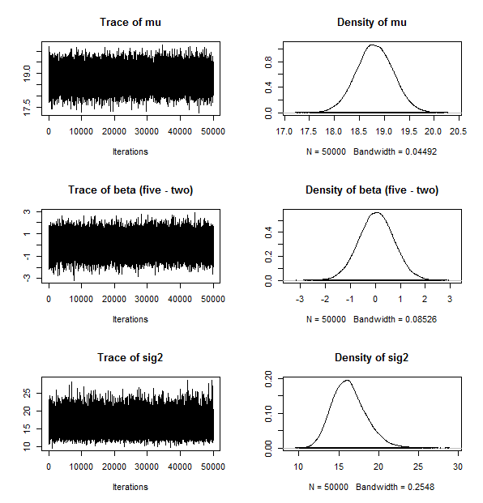
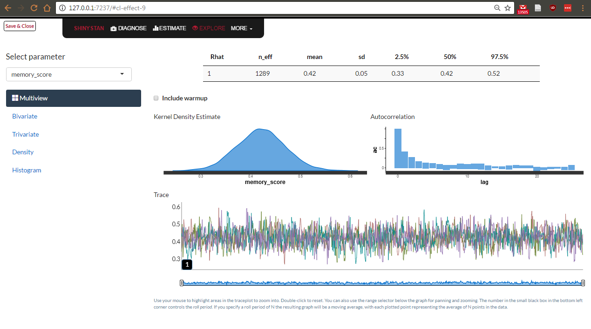

```{r, include=FALSE}

set.seed(23)

knitr::opts_chunk$set(warning = FALSE, error = FALSE, message = FALSE, fig.align = "center")
#library(knitr)
library(tidyverse)
library(broom)
library(effsize)

n_ppt = 120
n_trial = 30

# data for t-tests, ANOVA and mixed models
df1 <- data_frame(
  id = factor(paste("ppt", 1:n_ppt, sep = "_")),
  year = rep(factor(c("two", "five")), each = n_ppt/2),
  school = rep(factor(c("school1", "school2")), times = n_ppt/2),
  memory_score = c(rnorm(n_ppt/2, mean = 10, sd = 4.1), rnorm(n_ppt/2, mean = 12, sd = 4.3)),
  attention_score = c(rnorm(n_ppt/2, mean = 19, sd = 4.1), rnorm(n_ppt/2, mean = 19, sd = 4.3)),
  attainment = 0.5 * memory_score + 0.1 * attention_score + 2.5 * as.numeric(year) + rnorm(n_ppt, sd = 2)
)

# data for logistic regression
df2 <- data_frame(
  id = rep(factor(paste("ppt", 1:n_ppt, sep = "_")), times = 2),
  n_correct = c(rbinom(n_ppt, n_trial, prob = 0.6), rbinom(n_ppt, n_trial, prob = 0.5)),
  rt = c(rnorm(n_ppt, mean = 1500, sd = 300), rnorm(n_ppt, mean = 1700, sd = 300)),
  condition = rep(c("baseline", "cog_load"), each = n_ppt)
)
```

## Overview
+ Frequentist analysis in R
    + t tests & ANOVAs
    + Regression
    + Mixed effect models
+ Bayesian analysis in R
    + Bayes Factor
    + Bayesian estimation
        
## The fake data | Dataset 1
+ 4 variables:
    + id: participant ID
    + year: year group
    + school: school of the participant
    + memory_score: score on some memory task
    + attention_score: score on some attention task
    + attainment: score on some measure of academic attainment

        
## The fake data | Dataset 1
```{r}
df1
```

## The fake data | Dataset 2
+ 4 variables:
    + id: participant ID
    + n_correct: number of correct trials
    + rt: reaction time
    + condition: experimental condition

## The fake data | Dataset 2
```{r}
df2
```

## A note on tibbles
+ Tibbles, the data.frame format used by tidyverse packages (e.g. dplyr), don't work with some statistical packages (e.g. `ez`, `BayesFactor`)
    + All you have to do is convert your tibble to a data.frame with `as.data.frame()`
    + Do this in the call to a function to avoid changing your stored tibble
+ `BayesFactor` also requires you to convert character columns into factors
    + Other packages are more forgiving on this 

# Frequentist analysis in R

## Frequentist analysis in R 
+ There are function in base R for a lot of the stuff you'd want to do
+ However, it sometimes easier to do things with a package

## Frequentist analysis in R | t test

```{r}
t.test(formula = memory_score ~ year, data = df1, paired = FALSE)
```

## Frequentist analysis in R | t test

+ Or if we had wide data
```{r eval = F}
t.test(x = memory_year2, y = memory_year5, data = df_wide, paired = FALSE)
```
+ **Note:** R uses Welch's t-test as standard
    + See [here](http://daniellakens.blogspot.co.uk/2015/01/always-use-welchs-t-test-instead-of.html) for info on this

## Frequentist analysis in R | An ANOVA warning
+ There are multiple ways to calculate the sum of squares (SS) for an ANOVA
+ The inbuilt `aov()` function uses Type I SS, which isn't what we usually want
+ Typically we want Type III SS (e.g. this what SPSS uses)

## Frequentist analysis in R | ANOVA
```{r}
library(ez)

ezANOVA(data = as.data.frame(df1), dv = attainment, wid = id, between = .(year, school),
        type = 3, detailed = FALSE)

```

## Frequentist analysis in R | ANOVA
```{r}
ezANOVA(data = as.data.frame(df1), # data
        dv = attainment, # dependent variable
        wid = id, # subject ID
        between = .(year, school), # between subject factors
        type = 3, # type of SS
        detailed = FALSE) # detailed output?

```

## Frequentist analysis in R | linear regression
```{r eval = F}
lm(attainment ~ memory_score + attention_score + year + school, data = df1) %>%
  summary()
```

## Frequentist analysis in R | linear regression
```{r echo = F}
lm(attainment ~ memory_score + attention_score + year + school, data = df1) %>%
  summary()
```

## Frequentist analysis in R | linear regression
```{r}
library(lm.beta)

lm(attainment ~ memory_score + attention_score + year + school , data = df1) %>%
  lm.beta()
```

## Frequentist analysis in R | logistic regression
```{r}
fit_logistic <- glm(cbind(n_correct, 30 - n_correct) ~ condition, 
                     family = binomial(link = "logit"), data = df2) %>%
  summary()
```

## Frequentist analysis in R | logistic regression

```{r}
fit_logistic$coefficients

plogis(fit_logistic$coefficients[1,1] + fit_logistic$coefficients[2,1])
```

## Frequentist analysis in R | mixed effects models
```{r}
library(lme4)

(fit_mixed <- lmer(rt ~ condition + (1 | id), data = df2))
```


## Frequentist analysis in R | Online stuff
+ A number of the resources discussed in my last talk also cover analysis
    + E.g. [Datacamp](https://www.datacamp.com/courses/topic:probablity_and_statistics)
+ [Linear models in R](http://www.bodowinter.com/tutorial/bw_LME_tutorial1.pdf)
+ [Mixed-effects models for repeated-measures ANOVA](http://www.uni-kiel.de/psychologie/rexrepos/posts/anovaMixed.html) 
+ [Basic mixed-effects models tutorial](http://www.bodowinter.com/tutorial/bw_LME_tutorial2.pdf)
+ [Interactions and contrasts](http://genomicsclass.github.io/book/pages/interactions_and_contrasts.html)
+ Forgot [R-bloggers](https://www.r-bloggers.com/) last time

## Frequentist analysis in R | books and papers
+ Paper on why we should use logisitics regression for accuracy data ([Jaeger, 2008](https://www.ncbi.nlm.nih.gov/pmc/articles/PMC2613284/))
+ [Data Analysis Using Regression and Multilevel/Hierarchical Models](http://www.stat.columbia.edu/~gelman/arm/)

# Bayesian analysis
## Bayes Factors
+ The ratio of the likelihood of our data under one model versus another. 
    + E.g. null v.s. alternative
+ Useful for things like quantifying evidence for the null


## Bayes Factor | t test
```{r}
library(BayesFactor)

ttestBF(formula = memory_score ~ year, data = as.data.frame(df1), paired = FALSE)
```
+ **Note:** the frequentist equivalent of this analysis was significant

## Bayes Factor | t test
```{r}
bf1 <- ttestBF(formula = attention_score ~ year, 
               data = as.data.frame(df1), paired = FALSE)

1/bf1 # 1 / bf to get evidence for the null
```
## Bayes Factor | t test

```{r}
# posterior = TRUE gives us posterior samples instead of the standard Bf analysis

samples <- ttestBF(formula = attention_score ~ year, data = as.data.frame(df1), 
                   paired = FALSE, posterior = TRUE, iterations = 5e04)
```

## Bayes Factor | t test

```{r}
summary(samples)[1]
```

## Bayes Factor | t test

```{r}
samples_df <- as_data_frame(samples)

ggplot(data = samples_df, aes( x = `beta (five - two)`, y = ..density..)) +
  geom_histogram(colour = "black", fill = "gray30", alpha = 0.5) +
  geom_density(alpha = .3, fill = "purple")
```

## Bayes Factor | base plots

```{r eval = F}
plot(samples)
```

<div align = "center">
  
</div>  


## Bayes Factor | ANOVA
```{r}
anovaBF(attainment ~ year + school, data = as.data.frame(df1), whichRandom = "id", 
        iterations = 5e04) %>%
  head()
```

## Bayes Factor | Linear regression
```{r}
regressionBF(attainment ~ memory_score + attention_score, data = as.data.frame(df1)) %>%
  head() # gives the most likely model in order of likelihood
```

## Bayes Factor | Linear regression
+ Can't use `regressionBF()` for catergorical predictors
```{r}
lmBF(attainment ~ memory_score + attention_score + year + school, 
     data = as.data.frame(df1))
```

## Bayesian estimate | Overview
+ Specify probabilistic models to estimate parameter values
+ Can write the whole model yourself (e.g. with Stan, JAGS, BUGS)
    + All of these have R packages associated with them
+ Another option is to use the higher level package `rstanarm` (see also `brms`). This package uses syntax based on the `lme4` package
    + Easier to learn and read
    + Offers pre-compiled models for most of the stuff you'll want to do
    
## rstanarm | linear regression
```{r, message = F}
library(rstanarm)

options(mc.cores = parallel::detectCores())

fit1 <- stan_lm(attainment ~ memory_score + attention_score + year + school,
                data = df1, 
                prior = R2(location = 0.2)) # prior as R^2
```

## rstanarm | linear regression
```{r}
fit1
```

## rstanarm | ShinyStan

```{r, eval = F}
launch_shinystan(fit1)
```

<div align = "center">
  
</div>  

## Bayesian analysis in R | online resources
+ `BayesFactor` [Manual](http://bayesfactorpcl.r-forge.r-project.org/)
+ Understanding Bayes [blogs](https://alexanderetz.com/understanding-bayes/)
+ `rstanarm` [vignettes](https://cran.r-project.org/web/packages/rstanarm/vignettes/rstanarm.html)

## Bayesian analysis in R | books
+ [Doing Bayesian Data Analysis](http://www.indiana.edu/~kruschke/DoingBayesianDataAnalysis/)
+ [Statistical Rethinking: A Bayesian Course with Examples in R and Stan](http://xcelab.net/rm/statistical-rethinking/)
+ [Bayesian Data Analysis](http://www.stat.columbia.edu/~gelman/book/)

## Misc tips
+ Change the type of contrasts used
    + `options(contrasts=c('contr.sum', 'contr.sum'))`
    + Useful guide to contrast [here](http://www.ats.ucla.edu/stat/r/library/contrast_coding.htm)
+ Remember the [broom](ftp://cran.r-project.org/pub/R/web/packages/broom/vignettes/broom.html) package from last time for cleaning up modelling outputs
    
# Your assignment 

## The data
```{r, echo = F}
df3 <- read_csv("data/assignment-data.csv")

df3
```

## The columns
+ **id:** participant ID
+ **condition:** memory condition, either single or dual task
+ **site:** where the data was collected (UK or US)
+ **memory_score:** performance on a the memory task

## The questions
+ Is there a difference in performance between the two conditions?
+ Does it matter where the data was collected?
+ Do condition and where the data was collected interact?
+ Optional (advanced): does baseline performance vary by participant?

## Additional things to try
+ Put the data is wide format
    + I.e. columns for UK_single, UK_dual, US_single, US_dual
+ Make some plots

## Find the materials
+ Head to [https://github.com/eddjberry/intro-to-R-talks](https://github.com/eddjberry/intro-to-R-talks)
    + The data is in the data folder


